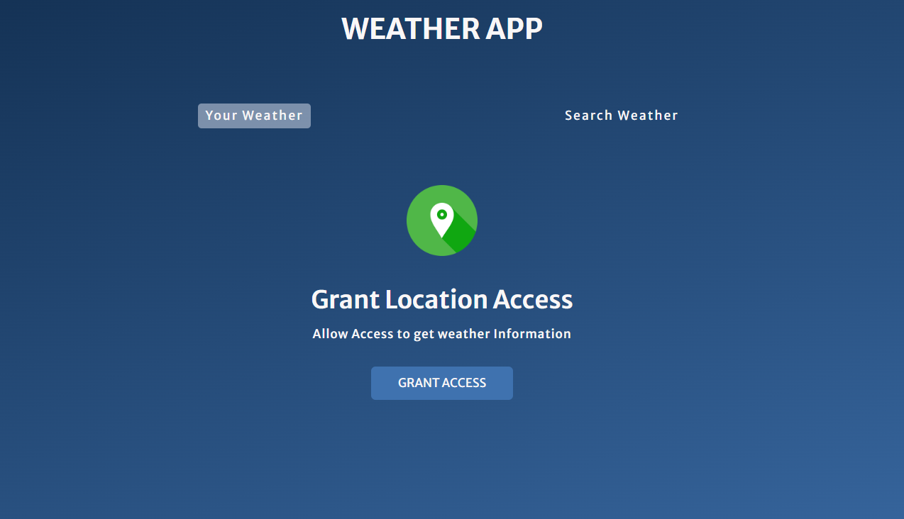
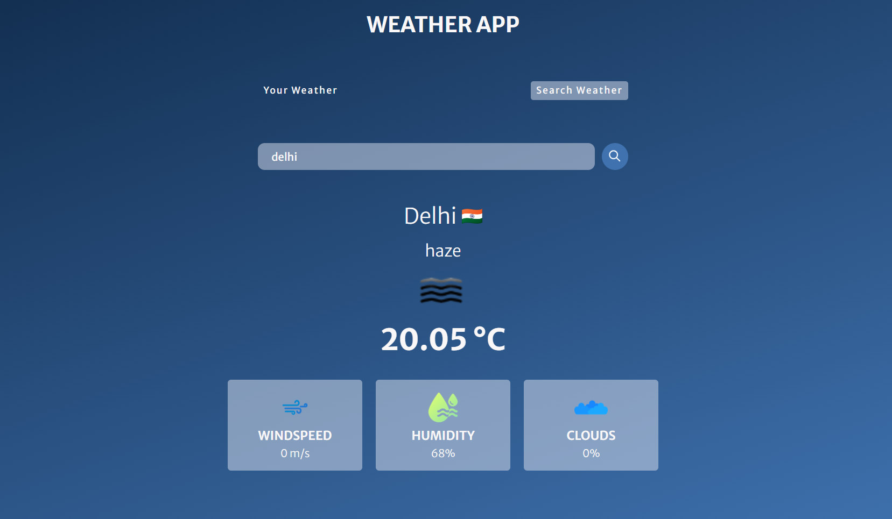

# Weather App 🌤️

A dynamic weather app that allows users to fetch real-time weather data based on their current location or any city worldwide. The app is built using JavaScript, HTML, CSS, and the OpenWeather API.

## Features 🚀

- **Current Location Weather**: Fetches weather data based on the user's geolocation, providing real-time data for the current area.
- **City-Based Search**: Allows users to enter any city name to view current weather conditions for that specific location.
- **Session Storage**: Stores user coordinates in session storage to avoid repeated geolocation requests, enhancing the user experience.
- **Error Handling**: Displays meaningful error messages for issues such as denied geolocation permissions, unavailable weather data, or incorrect city names.
- **User-Friendly Interface**: An interactive UI with loading screens, error displays, and a tab-switching layout to navigate between location-based and search-based weather displays.

## Technologies Used 🛠️

- **Frontend**: JavaScript, HTML, CSS
- **API**: OpenWeather API for fetching weather data

## How It Works 📝

1. **Location-Based Weather Fetching**:  
   - Uses the browser's Geolocation API to get the user's current coordinates.
   - Retrieves weather data for the coordinates from the OpenWeather API.
   - Displays data including city name, temperature, weather description, wind speed, humidity, and cloudiness.

2. **City-Based Weather Search**:  
   - Users can switch to the search tab and enter a city name to fetch weather data.
   - Retrieves weather information for the specified city from the OpenWeather API.
   - Displays the weather details if the city is found; otherwise, it shows an error message.

3. **Error and Loading States**:  
   - Handles different error scenarios such as denied location permissions, network errors, and invalid city names.
   - Shows a loading screen while fetching data and replaces it with the data or error message accordingly.
